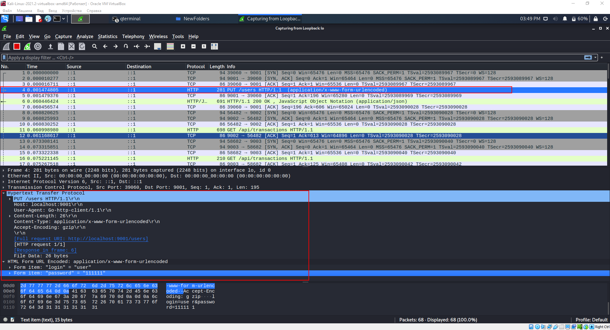
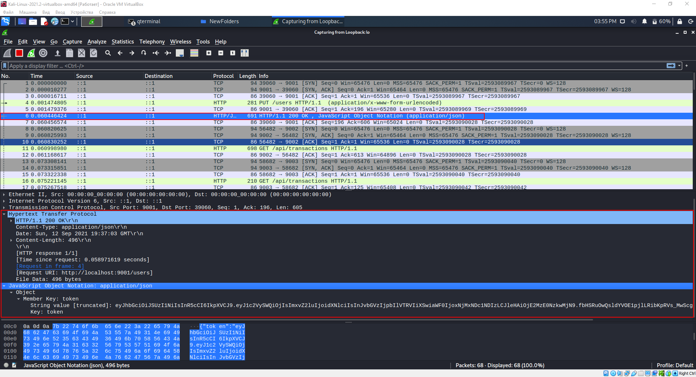
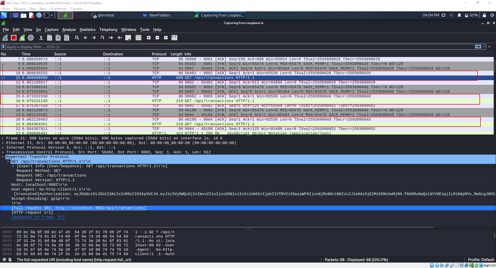
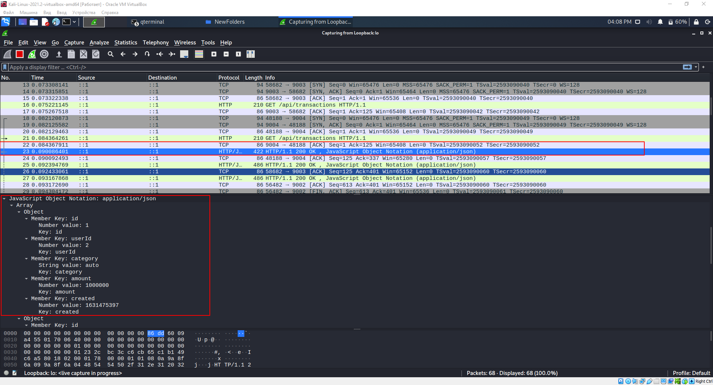
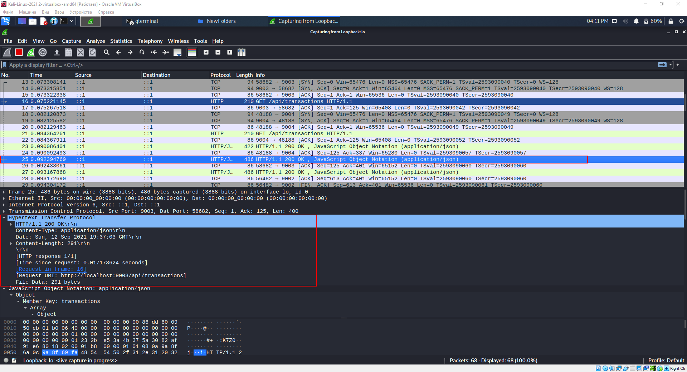
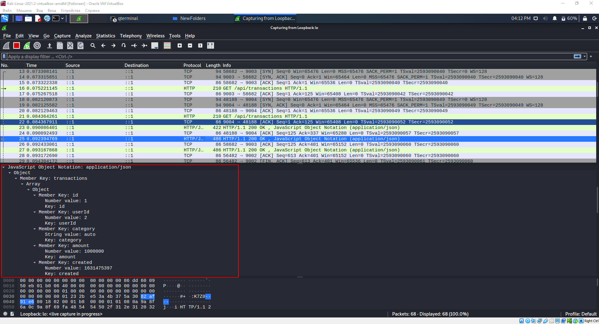
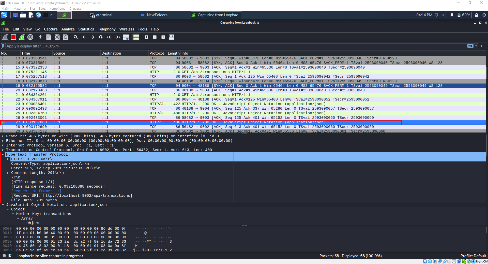
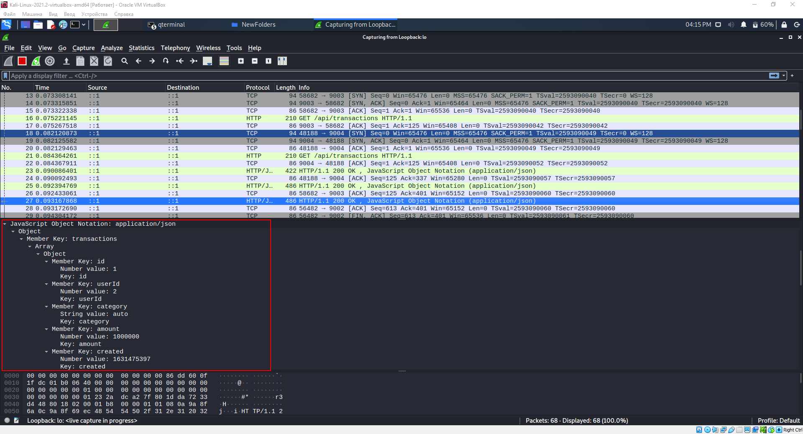

# Задание Карта взаимодействия

1. Сначала клиент и сервер приветствуют друг друга, а после клиент посылает данные (Логин и Пароль) на сервер №1 с портом 9001 

Client --> Server 1 (Отправка данных):

PUT [Full request URI: http://localhost:9001/users]
Content-Type: application/x-www-form-urlencoded\r\n

{
    Form item: "login" = "user"
    Form item: "password" = "111111"
}

2. Далее сервер №1 с портом 9001 отвечает клиенту

Server 1 --> Client (Ответ):

200 ОК
Content-Type: application/json\r\n

3. Далее клиент отправляет 3 последовательных запроса серверам 9002-9004

9002:

Client --> Server 2 (Запрос):

GET [Full request URI: http://localhost:9002/api/transactions]

9003:

Client --> Server 3 (Запрос):

GET [Full request URI: http://localhost:9003/api/transactions]

9004:

Client --> Server 4 (Запрос):

GET [Full request URI: http://localhost:9004/api/transactions]

4. После запросов клиента к серверам 9002-9004, они присылают ответ

9004:

Server 4 --> Client (Ответ):

200 ОК
Content-Type: application/json\r\n

9003:

Server 3 --> Client (Ответ):

200 ОК
Content-Type: application/json\r\n

9002:

Server 2 --> Client (Ответ):

200 ОК
Content-Type: application/json\r\n

